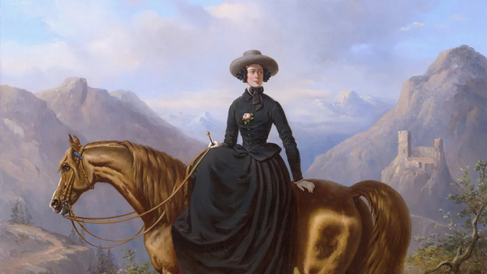
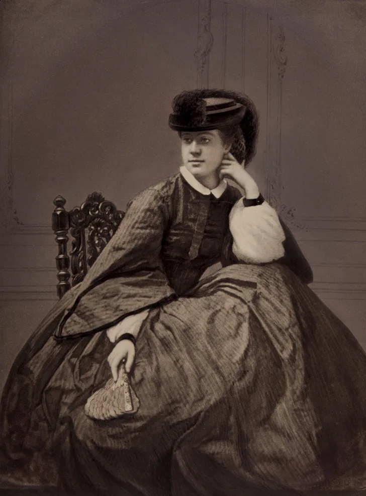
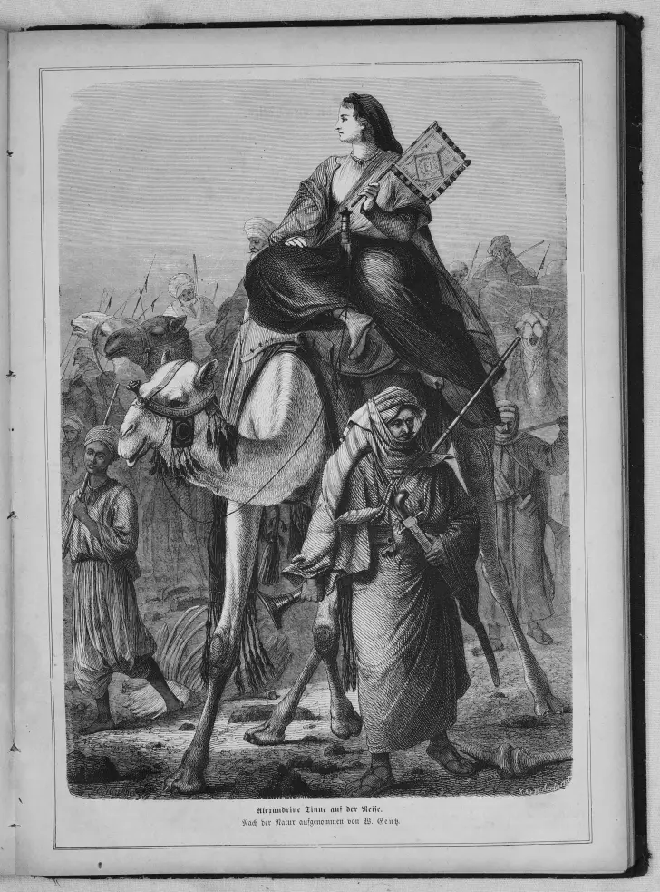

A well-chaperoned Grand Tour of Europe offered wealthy Victorian women a way to safely admire civilization’s wonders, but such travel held little interest for Dutch heiress Alexine Tinné. Having studied books on geography, archaeology, and botany at the Royal Library in the Hague, Tinné longed to explore uncharted regions. Her travels would bring her along the White Nile and later, deep within the Sahara Desert.

AN ESCAPE FROM VICTORIAN LIFE

In the mid-19th century, exploration was considered a gentleman’s pursuit. The Royal Geographic Society had never financed an expedition led by a woman (and wouldn't until 1904). But Tinné didn't need anyone to authorize or fund her trip, having inherited a fortune when she was 9 years old after the death of her father, Philip Frederik Tinné, a wealthy Anglo-Dutch sugar merchant and shipbuilder [PDF]. She could afford to travel in luxury with her mother, Baroness Henriette van Capellen, a former lady-in-waiting to Queen Sophie of Württemberg. When Tinné was 19, she and her mother traveled Europe and Scandinavia before heading to Egypt to enjoy pleasure cruises on the Nile.

According to Mylinka Kilgore Cardona, a history professor at Texas A&M University who is reworking her dissertation The Six Lives Of Alexine Tinné [PDF] into a book, Tinné’s travels offered a chance to escape the narrow confines of Victorian life. “She got to be her authentic self when she was outside of Europe,” Cardona tells Mental Floss. “She got rid of the corsetry and the crinolines and dressed like a local, albeit a wealthy local. Had she gone back to Europe she would have most likely been forced back into those expectations and highly encouraged to marry.”

EVENTFUL EXPEDITIONS
Tinné was so intrigued by Africa, she launched an 1863 expedition to what is now Sudan to discover the source of the Nile, something European explorers had sought since Roman times. Ornithologist Theodor von Heugelin and botanist Hermann Steudner joined Tinné’s 1863 expedition, which required a flotilla of boats to ferry her entourage of soldiers, maids, porters, and clerks, as well as the required camels and donkeys. Tinné’s five dogs, carried in panniers by porters, also accompanied the group.

Though she didn't find the source of the Nile, her adventures were still fruitful. Tinné documented her travels along the region’s waterways and settlements, compiling photographs and drawings now housed in museums. The plants she collected and pressed became the basis for Plantae Tinneanae, a book on the botany of Bahr el-Ghazal, and her letters, sent home by dispatch, described experiences that included traders promising to proclaim her Queen of the Sudan and receiving a marriage proposal from a sultan. 

To a niece, Tinné wrote of her intention to travel beyond Bahr el Ghazal in South Sudan. “When you look at the map you will see there is at the SouthWest of the Equator, a large space empty of names, it’s there we want to go to.”

Accounts of her travels not only thrilled newspaper readers of the day, but also were presented at The Royal Geographic Society. Yet some critics called Tinné a dilettante and claimed women were ill-suited to risky endeavors. “Exploration was this very macho masculine thing in the 19th century,” Cardona says. “To be out exploring and facing your fears. Then you have this 20-something-year-old woman doing it. How manly can it be if she is doing it too?”

TROUBLED TRAVELS

Tinné’s excursions were far from a leisurely holiday. Her entourage grew as she traveled, straining their resources. When food supplies ran low, her soldiers threatened to mutiny. In self-taught Arabic, the heiress persuaded them to continue, but she soon had to reverse course: While in Bahr el Ghazal, several members of her expedition became severely ill. Tinné and von Heugelin survived, but her mother, Steudner, and two maids died.

Tinné returned to Khartoum, where Adriana van Cappellen, an aunt who had previously left the expedition, had remained. Only weeks after Tinné arrived in Khartoum, Van Cappellen died unexpectedly. Despite suffering yet another devastating loss, the young explorer chose not to return to the Hague. “And now you will probably ask yourself what I am going to do,” she wrote to her niece. “And I don’t think you will be very astonished when I tell you I am going to stay in the East.”

For the next four years, Tinné lived in Alexandria, Tunis, and Tripoli, sailing the Mediterranean, but still longing to explore uncharted regions. In late 1868, she launched another expedition, aiming to be the first European woman to cross the Sahara. It would be her last.

